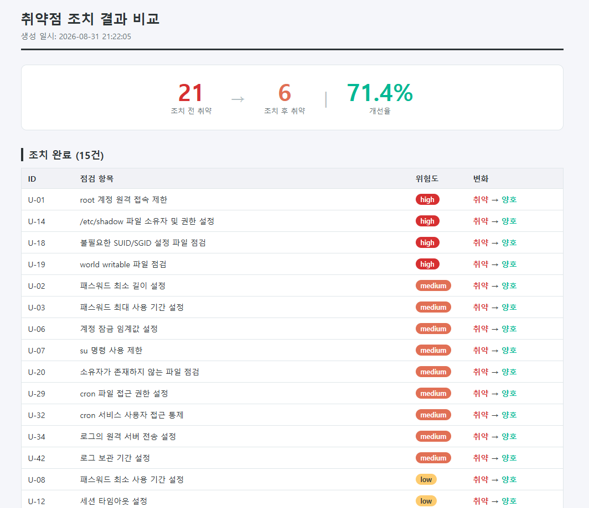
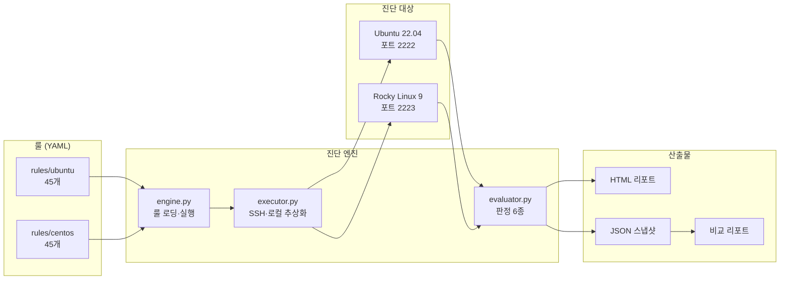
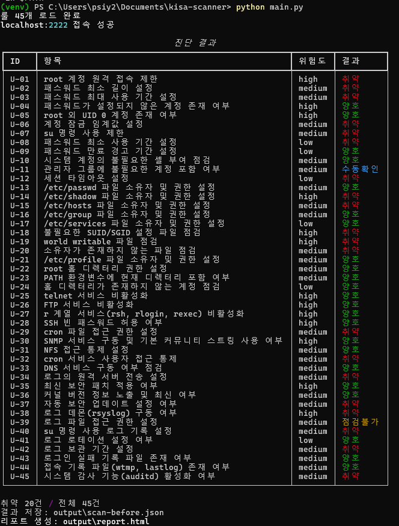
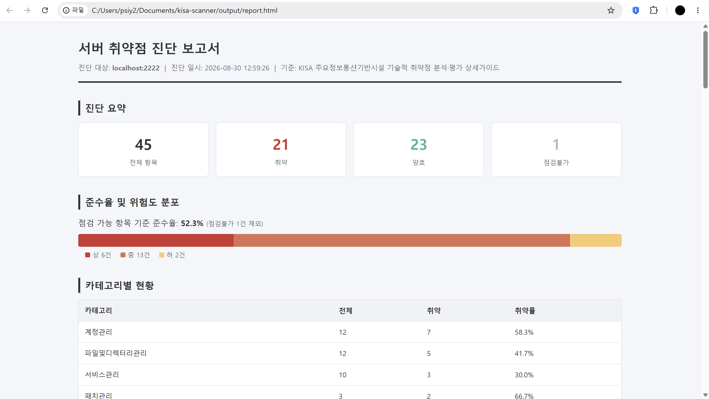

# KISA 서버 취약점 진단 자동화 도구

> 주요정보통신기반시설 기술적 취약점 분석·평가 상세가이드 기준의
> 리눅스 서버 취약점 진단을 자동화하는 룰 기반 스캐너



## 개요

45개 점검 항목을 SSH로 원격 진단하고, 조치 전후를 비교해 개선 현황까지
보고서로 산출합니다. 점검 로직을 코드가 아닌 YAML 룰로 분리하여
항목 추가 시 코드 수정이 필요 없도록 설계했습니다.

**진단 결과 예시** — Ubuntu 22.04 랩 환경

| 구분 | 조치 전 | 조치 후 |
|---|---|---|
| 취약 | 21건 | 6건 |
| 개선율 | — | **71.4%** |

## 주요 특징

**룰 기반 아키텍처**
점검 명령과 판정 기준을 YAML로 분리했습니다. 5일간 45개 항목을 추가하는
동안 파이썬 코드는 판정 타입 2개와 필드 2개만 늘었습니다.

**멀티 OS 지원**
Ubuntu(Debian 계열)와 Rocky Linux(RHEL 계열)를 지원합니다.
룰 디렉터리를 분리하여 코드 수정 없이 대상 OS를 전환합니다.

**4단계 판정 상태**
확인 불가와 확인 후 안전을 구분합니다. 자동 판정이 부적절한 항목은
별도 상태로 분리하여 담당자 검토 대상임을 명시합니다.

| 상태 | 의미 |
|---|---|
| 양호 | 확인했고 기준 만족 |
| 취약 | 확인했고 기준 미달 |
| 점검불가 | 확인 자체가 불가능 (명령 부재, 파일 없음) |
| 수동확인 | 확인은 했으나 자동 판정이 부적절 |

**증적 기반 보고서**
판정 결과와 함께 실제 점검 명령 및 그 출력을 리포트에 담아
담당자가 판정 근거를 검증할 수 있도록 했습니다.
## 아키텍처



### 모듈 구조

## 룰 스키마

```yaml
id: U-01
category: 계정관리
title: root 계정 원격 접속 제한
severity: high
os: [ubuntu]
manual_review: false        # 자동 판정 부적합 여부

description: |
  root 계정으로 SSH 직접 로그인이 가능하면 무차별 대입 공격의 표적이 되고,
  접속 주체를 특정할 수 없어 사후 추적이 어렵다.

check:
  type: command
  requires: [ss]            # 이 룰이 필요로 하는 명령
  command: "grep -Ei '^\\s*PermitRootLogin' /etc/ssh/sshd_config | grep -v '^\\s*#'"

evaluate:
  type: regex_match
  pattern: '(?i)PermitRootLogin\s+yes'
  on_match: vulnerable      # 매치되면 취약
  on_empty: safe            # 출력이 없으면 양호 (OpenSSH 기본값이 안전)

remediation: |
  /etc/ssh/sshd_config 에서 PermitRootLogin no 로 설정 후 SSH 재시작

reference: KISA 주요정보통신기반시설 기술적 취약점 분석·평가 상세가이드
```

### 판정 타입

| 타입 | 용도 |
|---|---|
| `regex_match` | 출력에서 특정 패턴 탐지 |
| `regex_not_match` | 패턴 부재 확인 |
| `exit_code` | 명령 종료 코드 비교 |
| `numeric_compare` | 수치 비교 (패스워드 길이, 보관 기간 등) |
| `permission_check` | 8진수 권한 비트 마스크 비교 |
| `port_exposure` | 리스닝 포트의 바인딩 주소 구분 |

`on_match`와 `on_empty`는 룰마다 방향이 다릅니다. 엔진은 매치 여부만
판단하고, 그 결과를 양호로 볼지 취약으로 볼지는 룰이 정합니다.
이 구조 덕분에 항목별 코드 분기가 필요 없습니다.

## 점검 항목

총 45개, 5개 카테고리

| 카테고리 | 항목 수 | 주요 내용 |
|---|---|---|
| 계정 관리 | 12 | root 원격접속, 패스워드 정책, UID 0 중복, su 제한 |
| 파일 및 디렉터리 | 12 | 주요 파일 권한, SUID/SGID, world-writable |
| 서비스 관리 | 10 | telnet·FTP·r 계열, SNMP, NFS, cron 접근통제 |
| 패치 관리 | 3 | 보안 패치 적용, 커널 버전, 자동 업데이트 |
| 로그 관리 | 8 | 로그 데몬, 파일 권한, 보관 기간, 감사 기능 |

## 실행 화면

**CLI 진단 결과**



**HTML 리포트**



## 사용법

### 사전 요구사항

- Python 3.11+
- Docker Desktop (랩 환경 구성 시)

### 설치

```bash
git clone https://github.com/psiy01/kisa-scanner.git
cd kisa-scanner
python -m venv venv
source venv/bin/activate      # Windows: .\venv\Scripts\Activate.ps1
pip install -r requirements.txt
```

### 진단 대상 랩 구성

```bash
cd lab
docker compose up -d --build
```

Ubuntu 22.04(포트 2222)와 Rocky Linux 9(포트 2223) 컨테이너가 기동됩니다.
두 환경 모두 의도적으로 취약 설정이 적용되어 있습니다.

### 진단 실행

```bash
# Ubuntu 진단
python main.py --host localhost --port 2222 --rules rules/ubuntu

# Rocky Linux 진단
python main.py --host localhost --port 2223 --rules rules/centos
```

| 옵션 | 기본값 | 설명 |
|---|---|---|
| `--host` | localhost | 진단 대상 호스트 |
| `--port` | 2222 | SSH 포트 |
| `--user` | root | 접속 계정 |
| `--password` | — | 접속 패스워드 |
| `--rules` | rules/ubuntu | 룰 디렉터리 |
| `--label` | before | 결과 파일 구분 라벨 |

### 조치 전후 비교

```bash
python main.py --label before          # 1차 진단
docker exec kisa-ubuntu bash /tmp/fix.sh   # 조치 적용
python main.py --label after           # 2차 진단
python compare.py                      # 비교 리포트 생성
```

`output/comparison.html` 에 개선 현황이 생성됩니다.

## 설계 판단

### 왜 룰을 코드에서 분리했는가

항목마다 함수를 작성하면 45개 항목에 45개 함수가 생기고, 점검 기준이
바뀔 때마다 코드를 수정해야 합니다. 무엇보다 진단 지식이 코드 안에 갇힙니다.

실제로 이 설계 덕분에 45개 항목을 추가하는 동안 파이썬 코드 변경은
판정 타입 2종(`permission_check`, `port_exposure`)과 필드 2개
(`requires`, `manual_review`) 추가에 그쳤습니다.

멀티 OS 지원 시에도 코드 수정 없이 룰 디렉터리만 추가했으며,
45개 중 38개는 Ubuntu 룰을 그대로 재사용했습니다.
POSIX 표준 명령(`stat`, `find`, `ss`)을 사용한 룰은 배포판과 무관하게
동작하기 때문입니다.

### 왜 판정 상태를 4가지로 나눴는가

확인하지 못한 항목을 양호로 처리하면 그것이 곧 미탐입니다.
실제로 개발 중 `ss` 명령이 없는 환경에서 서비스 점검 항목이 조용히
양호로 판정되는 문제가 있었고, `requires` 필드를 도입해
명령 부재 시 `점검불가`로 표시하도록 수정했습니다.

`수동확인`은 자동 판정이 원리적으로 불가능한 항목을 위한 상태입니다.
관리자 그룹 구성원 목록은 조회할 수 있지만, 각 계정의 필요 여부는
조직의 업무 맥락을 아는 담당자만 판단할 수 있습니다. 이 경우 명령은
실행하되 판정하지 않고, 증적만 수집하여 검토 대상임을 명시합니다.

### 보안 고려사항

리포트 생성 시 Jinja2의 `autoescape`를 명시적으로 활성화했습니다.
진단 대상의 명령 출력이 리포트 HTML에 삽입되는 구조이므로, 파일명에
스크립트 태그가 포함된 경우 리포트 열람 시 실행될 수 있습니다.
진단 도구가 공격 통로가 되지 않도록 하는 조치입니다.

진단 명령은 시스템을 변경하지 않습니다. 패치 상태 확인 시
`apt-get -s`(시뮬레이션), `dnf check-update`를 사용하며,
조치는 별도 스크립트로 분리했습니다.

## 알려진 한계

| 항목 | 내용 |
|---|---|
| 커널 버전 판정 | 메이저 버전만 확인하며, 빌드 번호 단위의 CVE 대조는 미지원 |
| 컨테이너 환경 | 로그 관련 항목은 전통적 서버 기준. 컨테이너는 stdout 위임이 정상 |
| SSH 호스트 키 | 랩 환경 편의를 위해 `AutoAddPolicy` 사용. 운영 환경에서는 `known_hosts` 검증 필요 |
| 자격증명 | 현재 CLI 인자로 전달. 환경변수 또는 SSH 키 인증으로 개선 예정 |
| `/etc/hosts` 권한 | 컨테이너에서는 런타임 마운트되어 빌드 시 수정 불가 |

## 라이선스

MIT License

## 사용 범위 고지

**본 도구는 소유하거나 명시적 사용 허가를 받은 시스템에만 사용해야 합니다.**

권한 없는 시스템에 대한 진단 행위는 정보통신망 이용촉진 및 정보보호 등에
관한 법률 위반에 해당할 수 있습니다. 랩 환경의 계정 정보는 테스트 목적으로
평문 노출되어 있으며, 실제 환경에서는 SSH 키 인증 또는 환경변수 주입을
사용해야 합니다.